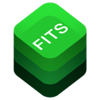

  
  
 

 

# FitsRaw now on Testflight!

FitsRaw is a leightweight viewer app for your iPad to view files in the [FITS file format](https://fits.gsfc.nasa.gov) commonly used in Astrophotography. For more information about the FITS file format head over to [NASA](https://fits.gsfc.nasa.gov/fits_documentation.html) of have a look ad [Wikipedia](https://en.wikipedia.org/wiki/FITS)

FitsRaw is currently availabe on [Testflight](https://testflight.apple.com). In order to join, just click ot the following URL: https://testflight.apple.com/join/Hr2K1Wg8

 

* Open FITS files and renders an image for the data unit of the primary HDU as image data
* Auto-detection of Grayscale, RGB and RGGB image data (particularly for the ZWO ASI294MC camera)
* Display the content of the header unit for the currently selected HDU
* Preliminary rendering of tables (Bintable only only display the first value of an array)
* Placeholder for empty HDUs or Image HDUs with less than 1 or more than 3 dimensions
* Rendering of thumbnails for the data unit of the primary HDU of FITS files in the file browser
* Rendering of preview for the data unit of the primary HDU for apples quicklook

FITS Raw currently supports only iPad OS and is tested with a rather old & slow iPad 5 on iPad OS 14.5.

For the latest updates and your feedback please see [Discussions](https://github.com/brampf/fitskit/discussions/6)

|  |  |
| :--------: | :-------: |
| **[FITSCore](https://github.com/brampf/fitscore)** | **[FITSKit](https://github.com/brampf/fitskit)** |

 

